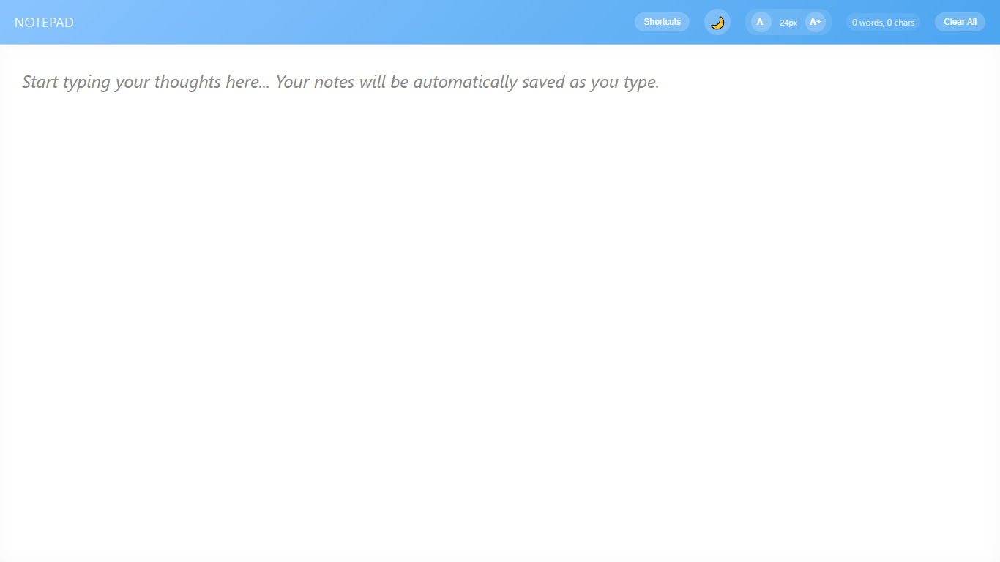
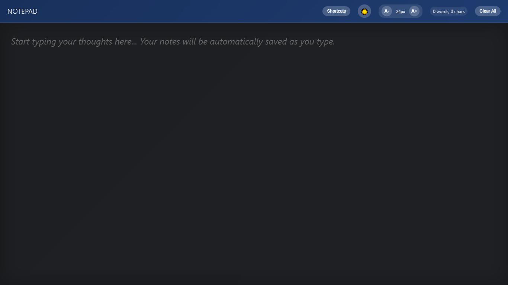

# 📝 Full-Screen Notepad

A beautifully designed full-screen Notepad web application with light/dark theme support, font-size control, auto-save feature, word count, and keyboard shortcuts.

## 🚀 Features

- 🌗 **Dark/Light Mode Toggle**  
  Easily switch between dark and light themes for a comfortable writing experience.

- 🔤 **Font Size Controls**  
  Increase or decrease text size for better readability.

- 💾 **Auto-Save Functionality**  
  Notes are automatically saved as you type. A subtle "Saved" indicator confirms every change.

- 🧮 **Live Word Count**  
  Displays the number of words in your note in real-time.

- 🧼 **Clear All Button**  
  Instantly clear your note with a single click.

- 🎹 **Keyboard Shortcuts**
  - `Ctrl + T`: Toggle Theme
  - `Ctrl + A`: Select All Text
  - `Ctrl + + / =` : Increase Font
  - `Ctrl + -`: Decrease Font
  - `Ctrl + 0`: Reset Font
  - `Ctrl + Delete`: Clear All
  - `ESC`: Blur Textarea

- 📱 **Responsive Design**  
  Fully optimized for desktops, tablets, and mobile devices.

## 📁 Project Structure

All code is embedded in a single HTML file for simplicity. It uses:

- Pure **HTML5**, **CSS3**, and **Vanilla JavaScript**
- CSS `flex` layout and `backdrop-filter` effects
- No external libraries or frameworks

## 🔧 How to Use

1. Download or clone this repository.
2. Open the `index.html` file in any modern web browser.
3. Start typing your notes. They will be saved automatically.
4. Use the controls in the header to:
   - Toggle theme
   - Change font size
   - Clear all text
   - View keyboard shortcuts

## 📷 Screenshot

> 
> 

## 🧠 Inspiration

This project was built to provide a distraction-free writing experience that’s simple, elegant, and functional – perfect for journaling, planning, or quick thoughts.

